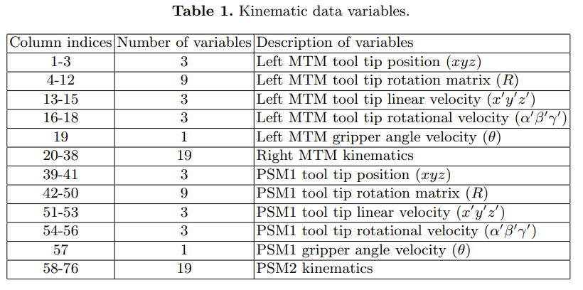
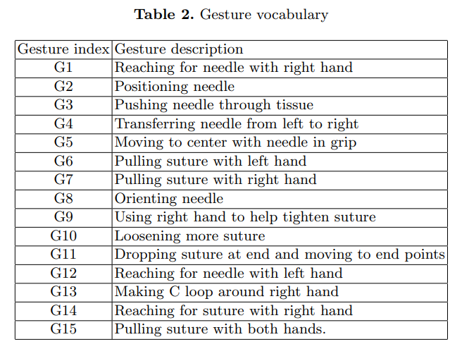

# About JIGSAWS

Master tool manipulators (MTMs)
Patient-side manipulators (PSMs)

Three types of operation:

- Suturing (SU):  39 trials
- Knot-Tying (KT): 36 trials
- Needle-Passing (NP): 28 trials, passing needle through small metal hoops

Subjects:

- Novice: B, G, H, I
- Intermediate: C, F
- Expert: D, E

- Kinematic data: Contains positions, orientations, velocities, angular velocities and gripper angle of the manipulators
  
- Video: Resolution of 640 x 480, 30Hz. Each video frame corresponds to kinematic frame captured
- Manual annotations: Start and end frame of gesture
  

Experiment Setup

- Leave-one-supertrial-out (LOSO): 5 folds
- Leave-one-user-out (LOUO): 8 folds
